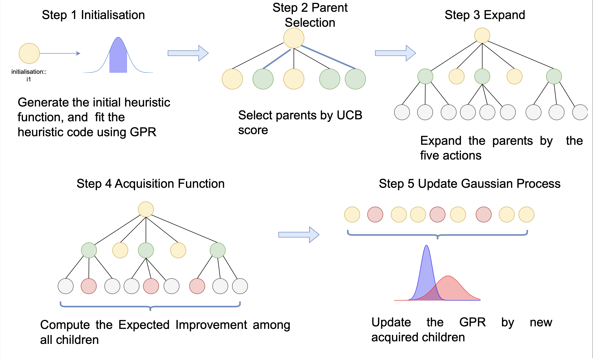

# BOTree-AHD


We propose BOTree-AHD, a novel framework that integrates Bayesian Optimization (BO) with a tree-structured representation of heuristics. By modelling the performance of heuristic functions, BOTree-AHD prioritizes informative evaluations and reduces unnecessary computation.





## Run

```
python main.py
```
The default running task is tsp_constructive

set cfg/config.yaml and run main.py for heuristic evaluations.

Please set the API key in corresponding llm_client. For example OpenAI client can be set in cfg/llm_client/open_ai.yaml, or you can choose other LLM API providers such Qwen3 and change the llm client in cfg/config.yaml


